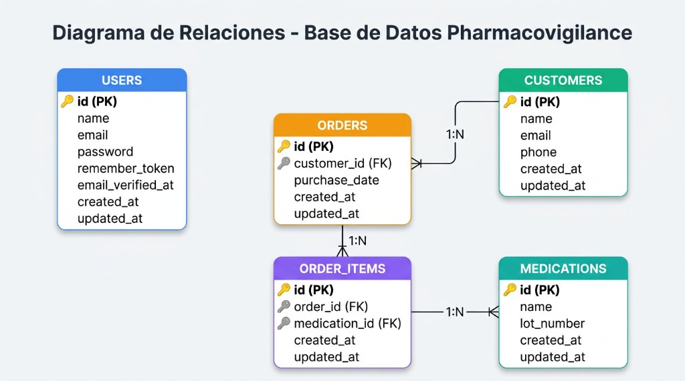

# Sistema de Farmacovigilancia - Instrucciones de Instalación

## Pasos para ejecutar el proyecto

### 1. Instalar dependencias de PHP
```bash
composer install
```

### 2. Instalar dependencias de Node.js
```bash
npm install
```

### 3. Configurar el archivo .env
Copiar el archivo .env.example a .env y configurar la base de datos:
```bash
copy .env.example .env
```

Editar el archivo .env y configurar la conexión a la base de datos:
```
DB_CONNECTION=mysql
DB_HOST=127.0.0.1
DB_PORT=3306
DB_DATABASE=prueba
DB_USERNAME=root
DB_PASSWORD=
```

## Diagrama de la Base de Datos



La base de datos está compuesta por las siguientes tablas:
- **USERS**: Usuarios del sistema con autenticación
- **CUSTOMERS**: Clientes/compradores de medicamentos
- **ORDERS**: Órdenes de compra realizadas por los clientes
- **ORDER_ITEMS**: Detalle de los medicamentos en cada orden
- **MEDICATIONS**: Catálogo de medicamentos con número de lote

### 4. Generar la clave de la aplicación
```bash
php artisan key:generate
```

### 5. Ejecutar las migraciones y seeders
```bash
php artisan migrate:fresh --seed
```

Esto creará las tablas necesarias y poblará la base de datos con datos de prueba, incluyendo:
- Un usuario de prueba: test@example.com / password
- 20 clientes
- 20 medicamentos (incluyendo uno con lot_number 951357)
- Órdenes y items de órdenes relacionados

### 6. Compilar los assets del frontend
En desarrollo:
```bash
npm run dev
```

Para producción:
```bash
npm run build
```

### 7. Iniciar el servidor
```bash
php artisan serve
```

El servidor estará disponible en: http://localhost:8000

## Credenciales de acceso

- User: test
- Password: password

## Flujo de la aplicación

1. El usuario inicia sesión en `/login`
2. Después del login, es redirigido automáticamente a `/order-search`
3. En la vista Order Search puede:
   - Buscar medicamentos por número de lote
   - Filtrar por rango de fechas
   - Ver los resultados de las órdenes
   - Ver detalles de una orden
   - Ver detalles de un cliente/comprador
   - Enviar alertas a clientes sobre medicamentos con problemas

## Características implementadas

- ✅ Sistema de autenticación completo
- ✅ Búsqueda de medicamentos por lote
- ✅ Filtrado de órdenes por fecha
- ✅ Vista de detalles de órdenes
- ✅ Vista de detalles de clientes
- ✅ Sistema de alertas a clientes
- ✅ Interfaz responsive con diseño moderno
- ✅ API RESTful completa
- ✅ Protección CSRF
- ✅ Middleware de autenticación

## Tecnologías utilizadas

- Laravel 12
- Vue 3 con TypeScript
- Inertia.js
- Tailwind CSS
- Axios
- Vite
